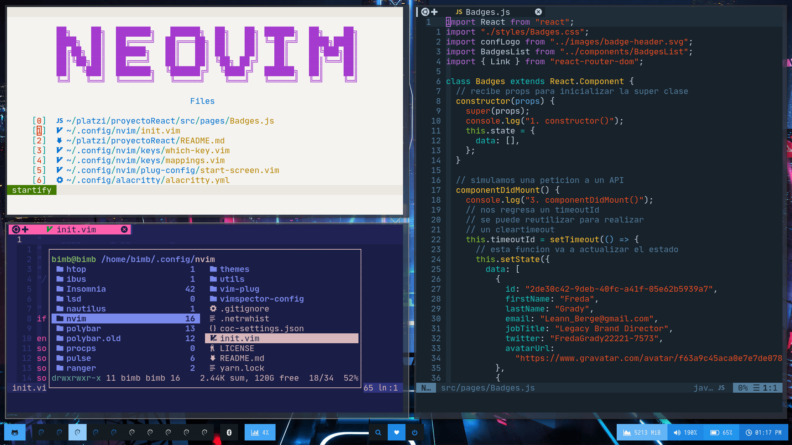
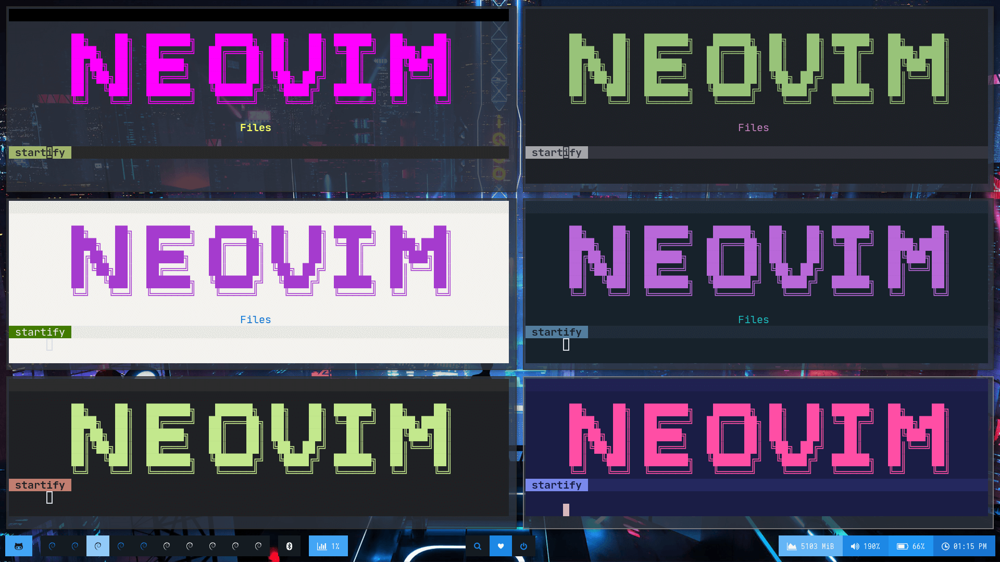

## Commands

> [Commands Vim](https://vim.rtorr.com/)

> [Commands Linux](https://blog.desdelinux.net/mas-de-400-comandos-para-gnulinux-que-deberias-conocer/)

## Install Neovim

- Mac

  ```
  brew install --HEAD neovim # Nightly version

  brew upgrade neovim --fetch-HEAD # Sometimes you need to update
  ```

- Ubuntu

  ```
  sudo apt-get update
  bash <(curl -s https://raw.githubusercontent.com/ChristianChiarulli/LunarVim/rolling/utils/bin/install-latest-neovim)
  nvim -v

  ```

- Arch

  ```
  yay -S neovim-git # Latest
  ```

### Install in one command this script only supports Mac, Ubuntu and Arch

- The following will install this config if you have an existing config it will move it to `~/.config/nvim.old`

```
bash <(curl -s https://raw.githubusercontent.com/bimbaquingoch/newNvcode/master/utils/install.sh)
```

- Or Clone this repo into your config

```
git clone https://github.com/bimbaquingoch/newNvcode.git ~/.config/nvim
```

### Enable light colorscheme

```
cp ~/.config/nvim/themes/ltoast.vim ~/.config/nvim/autoload/plugged/toast.vim/colors
```

### SSH KEY

- To enable git push and pull commands make a [SSH key](https://gist.github.com/bimbaquingoch/f82962545ec731682cf989c582b3fd21) and connect your repositories using SSH

## IMPORTANT

### if you want have online statistics from your daily work


### first create an account here [Waka Time](https://wakatime.com/)

<hr/>

### Nerd Font

> To see all files icons you must be installed nerd font [Nerd Font](https://www.nerdfonts.com/font-downloads), I recommend download JetBrainsMono Nerd Font

##### Download your font

```
unzip ~/Downloads/JetBrainsMono.zip
sudo mv *.ttf /usr/share/fonts
```

## Install python, node support and extra plugs

```
sudo pip3 install pynvim
sudo npm i -g neovim
sudo npm i -g pyright
sudo npm i -g bash-language-server
sudo npm i -g live-server
```
