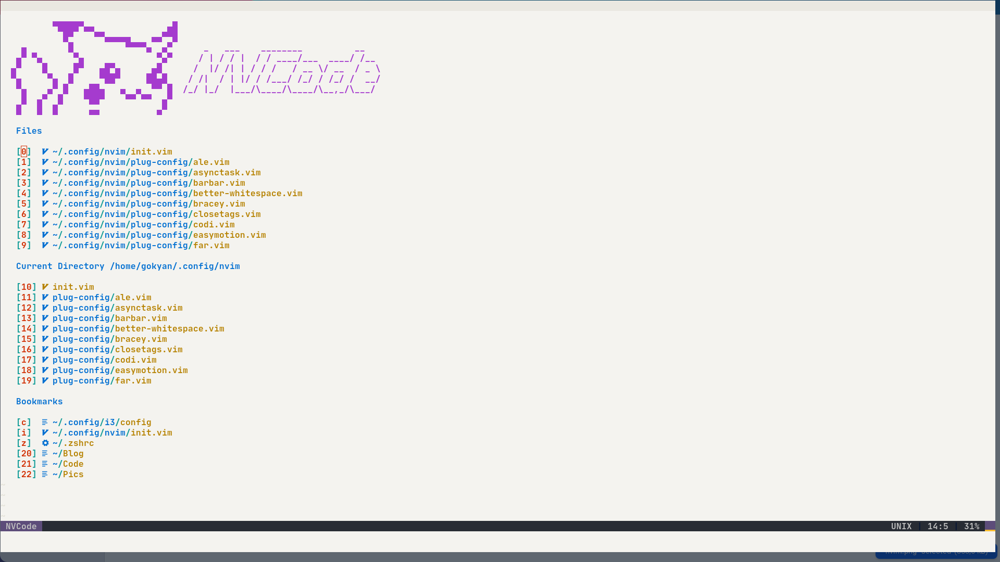
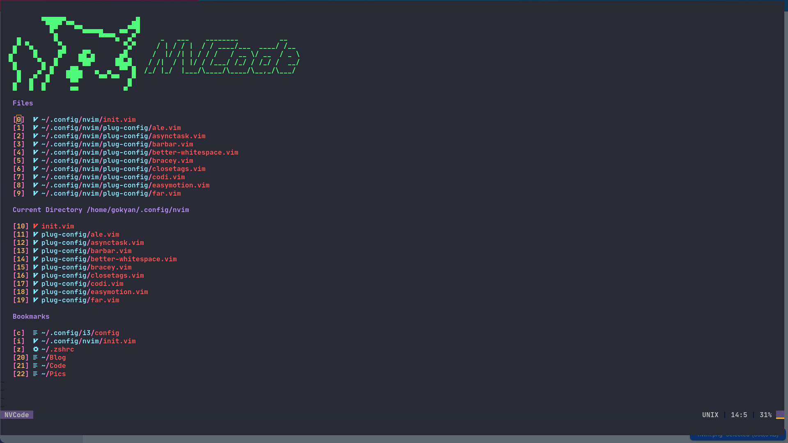
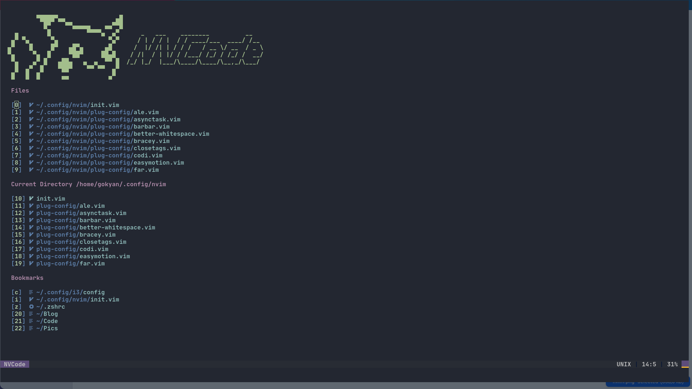
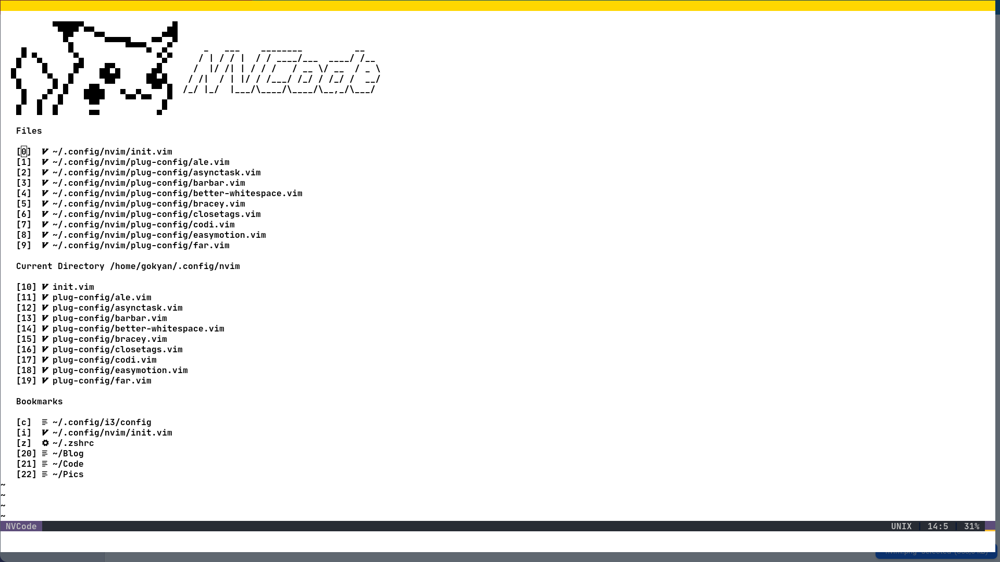
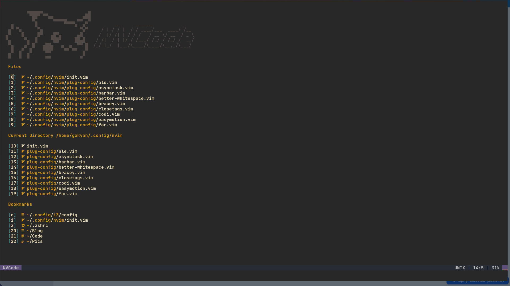
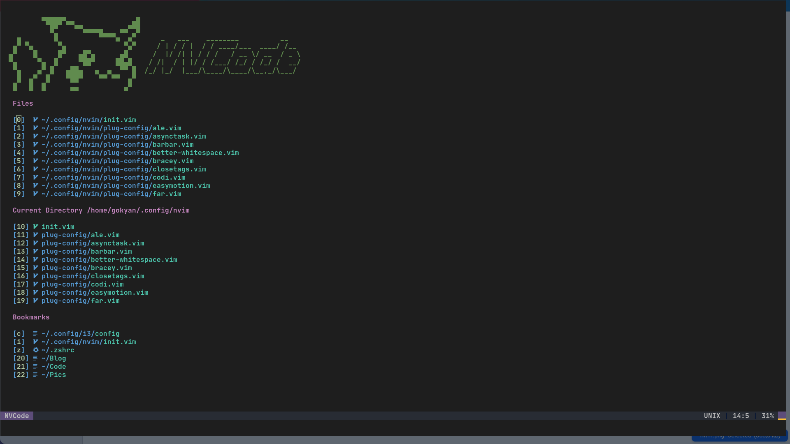
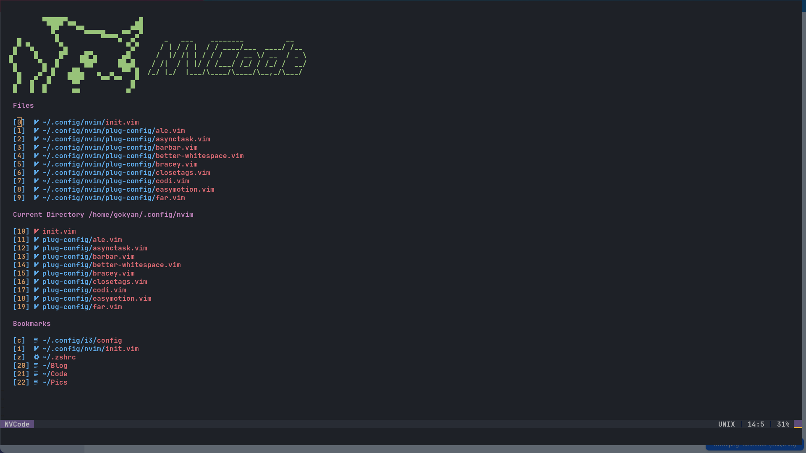
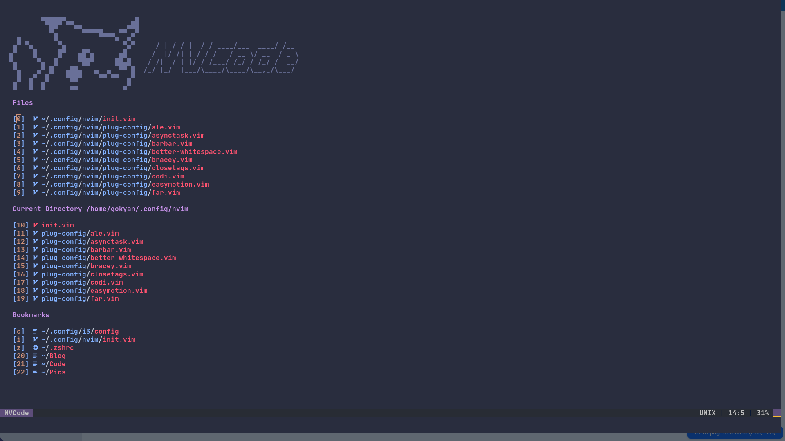
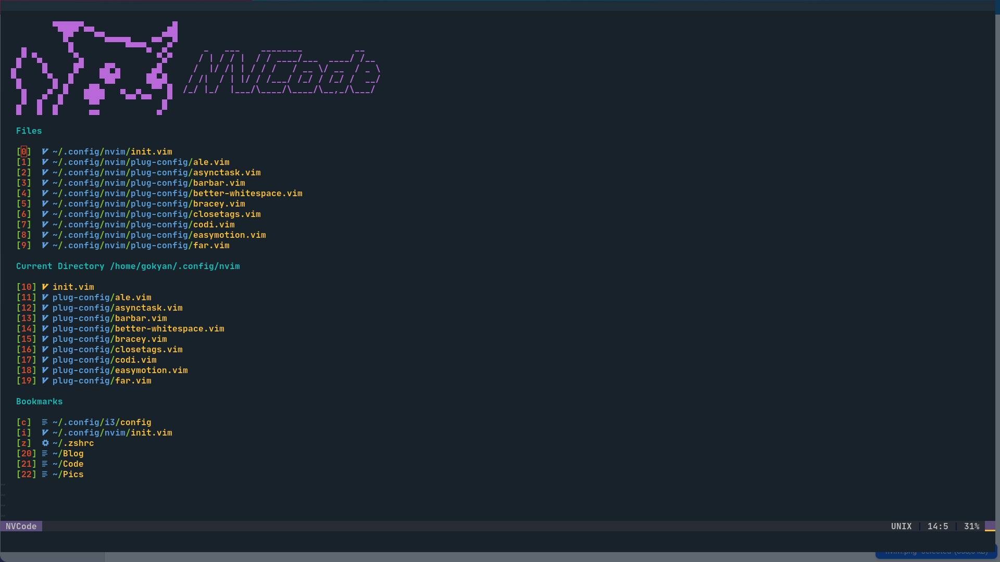
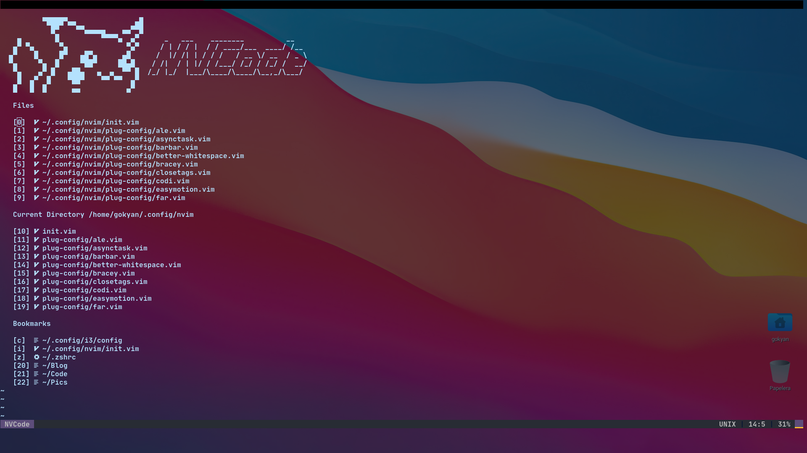

# NVCode













## Original Author

https://github.com/ChristianChiarulli/nvim

## Install in one command

The following will install this config if you have an existing config it will move it to `~/.config/nvim.old`

This script only supports Mac, Ubuntu and Arch

```
bash <(curl -s https://raw.githubusercontent.com/bimbaquingoch/nvcode/master/utils/install.sh)
```

## After install!!!

## if you want have online statistics from your daily work


## first create an account here

https://wakatime.com/

## and then when you write in your terminal

```
nvim
```

## there put your key from the page

## if you don't will use this go to


## and comment this line

## Install Neovim

- Mac

  ```
  brew install --HEAD neovim # Nightly version

  brew upgrade neovim --fetch-HEAD # Sometimes you need to update
  ```

- Ubuntu

  ```
  curl -l https://github.com/neovim/neovim/releases/download/nightly/nvim.appimage > /tmp/nvim.appimage

  sudo mv /tmp/nvim.appimage /usr/local/bin/nvim

  chmod +x /usr/local/bin/nvim
  ```

- Arch

  ```
  yay -S neovim-git # Latest
  ```

## Clone this repo into your config

```
git clone https://github.com/bimbaquingoch/nvcode.git
```

## Install python & node support

```
pip install pynvim
```

```
npm i -g neovim
```
