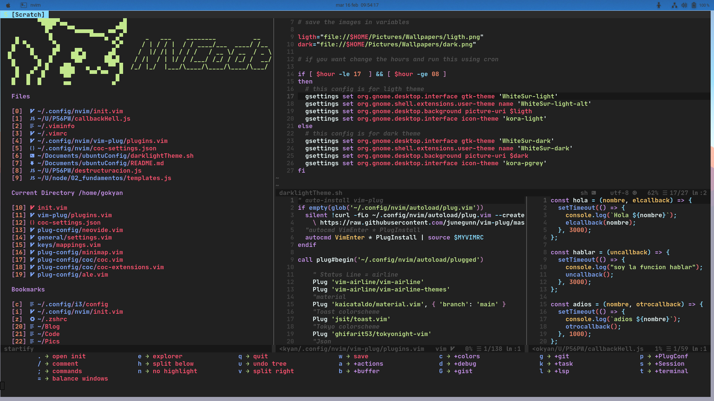

# This project is forked from [LunarVim](https://github.com/LunarVim/LunarVim)



## Commands

> [Commands Vim](https://vim.rtorr.com/)

> [Commands Linux](https://blog.desdelinux.net/mas-de-400-comandos-para-gnulinux-que-deberias-conocer/)

# Firts make sure have installed neovim 0.5 or higher, nodejs and python 3

## Install the latest version of Neovim

Ubuntu

```sh
sudo add-apt-repository ppa:neovim-ppa/unstable
sudo apt-get update
sudo apt-get install neovim
nvim -v
```

#### Install in one command (this script supports Mac, Ubuntu)

```sh
bash <(curl -s https://raw.githubusercontent.com/bimbaquingoch/newNvcode/master/utils/install.sh)
```

- Or Clone this repo into your config

```sh
git clone https://github.com/bimbaquingoch/newNvcode.git ~/.config/nvim
```

### SSH KEY

- To enable git push and pull commands make a [SSH key](https://gist.github.com/bimbaquingoch/f82962545ec731682cf989c582b3fd21) and connect your repositories using SSH

## IMPORTANT

### if you want have online statistics from your daily work


### first create an account here [Waka Time](https://wakatime.com/)

<hr/>

### Nerd Font

> To see all files icons, you must be installed nerd font [Nerd Font](https://www.nerdfonts.com/font-downloads), I recommend download JetBrainsMono Nerd Font

##### Download your font

```sh
unzip ~/Downloads/JetBrainsMono.zip
sudo mv *.ttf /usr/share/fonts
```

## Install python, node support and extra plugs

```sh
sudo pip3 install pynvim
sudo npm i -g neovim
sudo npm i -g pyright
sudo npm i -g bash-language-server
sudo npm i -g live-server
```
