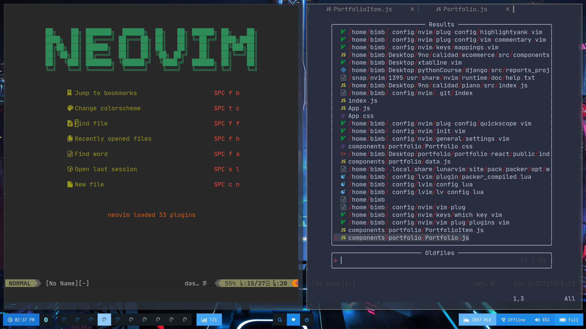

# NVCode

## Init



## Typescript


## Java


## HTML and CSS


## Python


## Terminal


## Original Author

https://github.com/ChristianChiarulli/nvim

## Comands

[Comands Vim](https://vim.rtorr.com/)
[Comands Linux](https://blog.desdelinux.net/mas-de-400-comandos-para-gnulinux-que-deberias-conocer/)

## Install in one command

The following will install this config if you have an existing config it will move it to `~/.config/nvim.old`

This script only supports Mac, Ubuntu and Arch

```
bash <(curl -s https://raw.githubusercontent.com/bimbaquingoch/newNvcode/master/utils/install.sh)
```

## IMPORTANT

### if you want have online statistics from your daily work


## first create an account here [Waka Time](https://wakatime.com/)

## write in your terminal

```
nvim
```

### there put your key from the page

### if you don't will use this, go to

```
nvim ~/.config/nvim/vim-plug/plugins.vim
```


## and comment this line

## Install Neovim

- Mac

  ```
  brew install --HEAD neovim # Nightly version

  brew upgrade neovim --fetch-HEAD # Sometimes you need to update
  ```

- Ubuntu

  ```
  sudo apt-get update
  sudo apt-get install snapd -y
  sudo snap install nvim --classic
  ```

- Arch

  ```
  yay -S neovim-git # Latest
  ```

## Clone this repo into your config

```
git clone https://github.com/bimbaquingoch/newNvcode.git ~/.config/nvim
```

### To see all files icons you must be installed nerd font

[Nerd Font](https://www.nerdfonts.com/font-downloads)

### I recommend JetBrainsMono Nerd Font

## Install python & node support

```
pip install pynvim
```

```
npm i -g neovim
```

## The leader key is space, this will show you a window with all functions, commands, and themes for your Text Editor.


